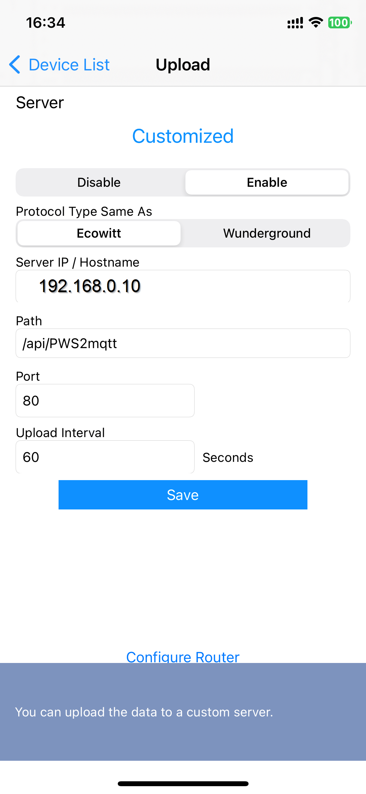

# Personal Weather Station (PWS)
This function app allows you to get the data **directly** from your own PWS (personal weather station) and publish this to MQTT. So this does **NOT** require that you register your PWS to cloud accounts, like WeatherUnderground, Ecowitt, WeatherCloud, WOW (takes weeks to get key), etc, or the use of WeeWX (extra software).

**This configuration will directly capture the data from your weather station!** 

## Thanks to Xorfor!
Special thanks to Xorfor who has created the [HA-PWS](https://github.com/Xorfor/HA-PWS) (and previously the Domoticz-PWS-Plugin) project initially. This PWS2mqtt project is inspirated by him and is using his calculations.

Do you like his work? Give him some [support](#support)
# Prerequisites
1. Your PWS needs to be connected to your network. This can be done by using [WS View](#ws-view-plus-ws-view-or-ws-tool) app.
1. [Docker-Compose (or docker)](https://docs.docker.com/compose/)
1. You need an Azure functions container. More info: [Azure Functions Powershell](https://hub.docker.com/_/microsoft-azure-functions-powershell)
1. You need Mosquitto. More info: [MQTT (Mosquitto)](https://hub.docker.com/_/eclipse-mosquitto)
[Or look at the example below](#azure-functions-powershell)
# Azure functions (PowerShell)
This function app, which can be ran in a docker container, will receive the data from PWS and publish it to MQTT.
Look at the [docker-comopose.yml](docker-compose.yml) for the docker setup that contains:
1. Azure Functions container
1. Mosquitto container
## Next steps
1. Download the [Function Apps](Function%20Apps) folder to '/home/{USER}/Function Apps'
1. Download the [.env.azfunc](.env.azfunc) file next to your **docker-compose.yml** file
1. Update the **.env.azfunc** file with its environment variables (like MQTT server, username, password, etc)
1. Add [MQTT sensors to HA](#home-assistant-configuration)
2. This requires the [HA MQTT integration](https://www.home-assistant.io/integrations/mqtt)

## Supported devices
In general, if the station is supplied with `EasyWeather` software (version 1.4.x, 1.5.x, 1.6.x), it is likely that the station will work with this HA Configuration!

### WS View Plus (WS View or WS Tool)
If supported by your PWS, connect your PWS with `WS View Plus` (and also the 'older' `WS View` or `WS Tool`) to your router by wifi, so that your PWS can upload weather data.

1. Install `WS View Plus` on your mobile device
    * [Google Play Store](https://play.google.com/store/apps/details?id=com.ost.wsautool)
    * [Apple App Store](https://apps.apple.com/nl/app/wsview-plus/id1581353359)
1. , or `WS View`
    * [Google Play Store](https://play.google.com/store/apps/details?id=com.ost.wsview)
    * [Apple App Store](https://apps.apple.com/us/app/ws-view/id1362944193)
1. , or `WS Tool`
    * [Google Play Store](https://play.google.com/store/apps/details?id=com.dtston.wstool)
    * [Apple App Store](https://apps.apple.com/nl/app/ws-tool/id1125344077)
1. Follow the instructions to connect your PWS to your router
1. Goto to Device List in Menu and choose your PWS
1. Click on Next until you are on on the `Customized` page
1. Choose `Enable`
1. For `Protocol Type Same As` choose `Ecowitt`
    * With Ecowitt the data will be send with a POST. Wunderground is using a GET, which is not supported by this solution.
1. For `Server IP / Hostname` enter your docker-server ip address, eg. 192.168.0.10
2. For `Path` enter: `/api/PWS2mqtt`
3. `Port` enter a port number `80`
4. `Upload Interval`, leave it `60` seconds
5. Click on `Save`



## Home Assistant configuration
Use the [configuration.yaml](Home%20Assistant/configuration.yaml) to setup the PWS entities.

Use the [customize.yaml](https://github.com/Xorfor/HA-PWS/blob/main/customize.yaml) to get appropriate icons for the entities

## Sensors
| ID                               | Type  |             UoM | Description
| :---                             | :---  |            ---: | :--- 
| `sensor.pws_temperature`         | Float |              °C | Outdoor temperature
| `sensor.pws_temperature_indoor`  | Float |              °C | Indoor temperature
| `sensor.pws_humidity`            | Int   |               % | Outdoor humidity
| `sensor.pws_humidity_indoor`     | Int   |               % | Indoor humidity
| `sensor.pws_barometer_relative`  | Float |             hPa | Pressure (relative)
| `sensor.pws_barometer_absolute`  | Float |             hPa | Pressure (absolute)
| `sensor.pws_rainrate`            | Float |            mm/h | Current rain rate
| `sensor.pws_rain`                | Float |              mm | Rain daily total
| `sensor.pws_solar_radiation`     | Float | W/m<sup>2</sup> | Solar radiation 
| `sensor.pws_uv`                  | Int   |        UV Index | UV Index
| `sensor.pws_wind_speed`          | Float |             m/s | Wind speed
| `sensor.pws_wind_gust`           | Float |             m/s | Wind gust
| `sensor.pws_wind_direction`      | Int   |               ° | Wind direction
| `sensor.pws_wind_direction_text` | Text  |                 | Wind direction in text, like 'North North West', 'North', 'Sout South West', 'Sout West', etc. (calculated, based on `sensor.pws_wind_direction`)
| `sensor.pws_wind_direction_abbreviation` | Text  |                 | Wind direction in text, like 'NNE', 'N', 'SSW', 'SW', etc. (calculated, based on `sensor.pws_wind_direction`)
| `sensor.pws_stationtype`         | Text  |                 | Firmware name/version, eg. `EasyWeatherV1.6.4`
| `sensor.pws_model`               | Text  |                 | Weatherstation model, eg. `WS2900`
| `sensor.pws_dewpoint`            | Float |              °C | Dew point (calculated, because it is not supported in the Ecowitt protocol)
| `sensor.pws_windchill`           | Float |              °C | Windchill (calculated, because it is not supported in the Ecowitt protocol)
| `sensor.pws_heat_index`          | Float |              °C | Heat index (calculated, based on `sensor.pws_temperature` and `sensor.pws_humidity`)

## Screenshots

'


## Data
Example of data received from the PWS:

```
{
  "PASSKEY": "xxxxxxxxxxxxxxxxxxxxxxxxxxx",
  "stationtype": "EasyWeatherV1.6.5",
  "dateutc": "2023-07-03+18:36:10",
  "tempinf": "74.8",
  "humidityin": "47",
  "baromrelin": "29.481",
  "baromabsin": "29.862",
  "tempf": "65.3",
  "humidity": "53",
  "winddir": "336",
  "windspeedmph": "15.0",
  "windgustmph": "18.3",
  "maxdailygust": "29.8",
  "rainratein": "0.000",
  "eventrainin": "0.000",
  "hourlyrainin": "0.000",
  "dailyrainin": "0.000",
  "weeklyrainin": "0.000",
  "monthlyrainin": "0.059",
  "yearlyrainin": "0.240",
  "totalrainin": "0.240",
  "solarradiation": "8.71",
  "uv": "0",
  "wh65batt": "0",
  "freq": "868M",
  "model": "WS2900_V2.01.18"
}
```

Example data sent to MQTT:
```
{
  "barometer_absolute": 1011.1,
  "wind_direction_entext": "West",
  "wind_direction": "266",
  "wind_gust": 4.6,
  "model": "WS2900_V2.01.18",
  "rainrate_mmh": 0.0,
  "temperature_indoor": 23.8,
  "solar_radiation": "10.01",
  "heat_index": 18.5,
  "humidity_outdoor": "53",
  "windchill": 18.5,
  "temperature_outdoor": 18.5,
  "uv": "0",
  "stationtype": "EasyWeatherV1.6.5",
  "rain_mm": 0.0,
  "barometer_relative": 998.2,
  "humidity_indoor": "47",
  "wind_direction_abbreviation": "W",
  "dewpoint": 8.7,
  "wind_speed": 3.3
}
```

## Possibilities
[Display rain per day](https://github.com/Xorfor/HA-PWS/blob/main/Rain_per_day.md)

[Display rainrate over a week](https://github.com/Xorfor/HA-PWS/blob/main/Rainrate.md)

## Support
[By Xorfor (who created the HA-PWS project) a 🍺](https://www.buymeacoffee.com/xorfor)